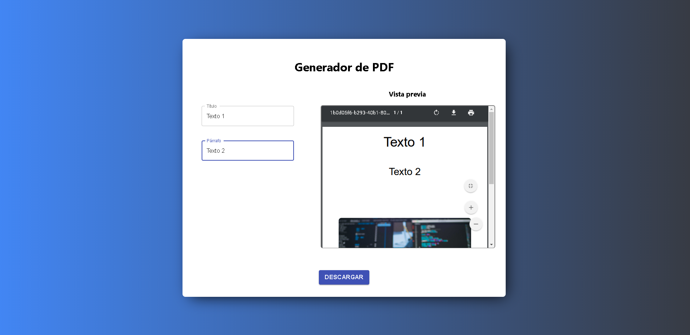

# Generador de PDF en React
## PROYECTO EN CONSTRUCCION

Pequeño ejemplo de como generar y tener una vista previa de un PDF desde el navegador, sin el uso de un servidor, con [react-pdf](https://react-pdf.org/).
También se utiliza algo de Materiaul-Ui, Styled-Components.

### Comandos para iniciar el proyecto
- npm i
- npm start

Open [http://localhost:3000](http://localhost:3000) to view it in the browser.
The page will reload if you make edits. 
You will also see any lint errors in the console.

## Primera Pantalla

